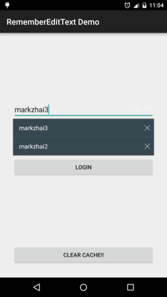

# RememberEditText [](https://github.com/markzhai/RememberEditText/releases/download/v0.9.0/app-debug.apk) [](https://maven-badges.herokuapp.com/maven-central/cn.zhaiyifan/rememberedittext)

An EditText which can remember last input, free developer from managing cache everywhere themselves.

[中文版](https://github.com/markzhai/RememberEditText/blob/master/README_CN.md "中文版")



## Introduction
Have you been annoyed with entering the same stuff once and once like username, thread-reply? RememberEditText can remember the last several input automatically and offers a dropdown list to let user choose.

## How
View: RememberEditText is an EditText view, but not a viewgroup extends linearlayout like some project. I made it so in order to decrease view layers.

Cache: RememberEditText simply puts its cache in SharedPreference, and keeps a local hashmap version to free from visiting SharedPreference everytime, thus speeds up its looks up and update.

## Usage

```gradle
dependencies {
    compile 'cn.zhaiyifan:rememberedittext:0.9.0'
}
```

```xml
<cn.zhaiyifan.rememberedittext.RememberEditText
    android:id="@+id/username"
    android:layout_width="match_parent"
    android:layout_height="wrap_content"
    android:layout_centerHorizontal="true"
    android:layout_marginLeft="@dimen/activity_horizontal_margin"
    android:layout_marginRight="@dimen/activity_horizontal_margin"
    android:layout_marginTop="150dp"
    android:hint="Username/PhoneNumber"
    android:inputType="text"
    app:rememberCount="3"
    app:rememberId="username" />
```

styles:
```xml
<declare-styleable name="RememberEditText">
    <!-- auto fill in cache, by default true -->
    <attr name="autoFill" format="boolean" />
    <!-- auto save to cache, by default true -->
    <attr name="autoSave" format="boolean" />
    <!-- dropdown icon to choose between cache values, by default use abc_spinner_mtrl_am_alpha -->
    <attr name="dropDownIcon" format="reference" />
    <!-- delete icon to delete cache value, by default use abc_ic_clear_mtrl_alpha -->
    <attr name="deleteIcon" format="reference" />
    <!-- id of cache, will use view id if not set -->
    <attr name="rememberId" format="string" />
    <!-- count of cache to keep, by default 3 -->
    <attr name="rememberCount" format="integer" />
</declare-styleable>
```

## TODO
- Make cache loading async.
- Add more hint mode.
- Enable pair mode, like username/password.
- Center gravity is not supported yet, need help (icon is missing when set center gravity).
- Add encrpytion mode to save stuff like password (low priority).
- Support RTL (Right to Left).

## Screenshots


