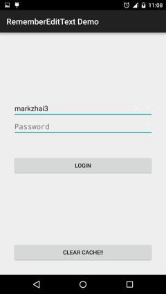
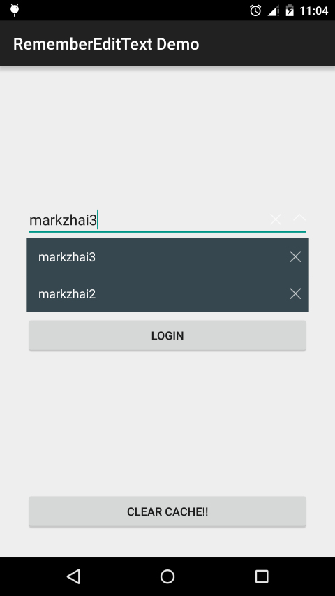
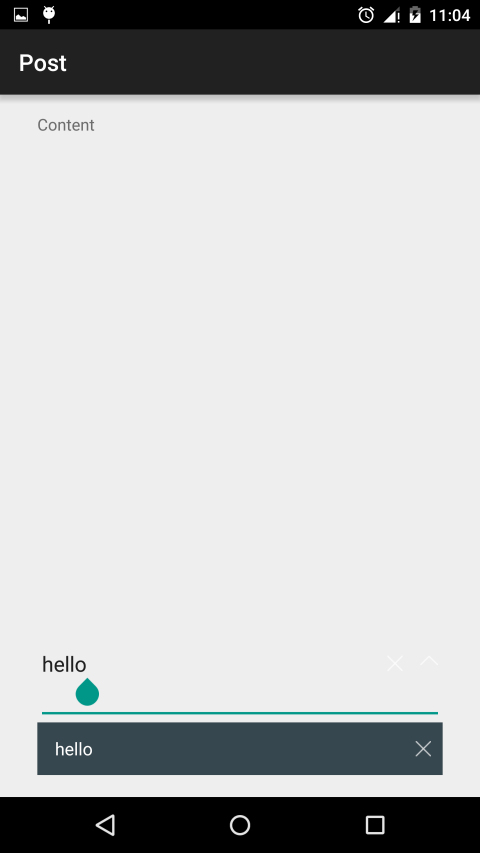

# RememberEditText
一个自定义EditText View，可以记住该view的最近几次输入，使开发者不用到处去单独做cache逻辑。





## 介绍
你有没有为了需要每次输入相同的内容而感到恼火？这个账号/密码上次不是输过了么，怎么又让我输？我就是想回个帖罢了，怎么每次还得重复输入“感谢分享”、“顶”？
RememberEditText做的就是自动记住最近的几次输入，并提供UI给用户直接选择。

## 原理
RememberEditText扩展了EditText，在UI上添加了删除/下拉框，提供删除缓存和选择缓存值的功能。在数据保存上，其内部实现了一个通过SharedPreference存放的PersistedMap，由于实际提供服务的数据来源是内存中的map，所以可以做到快速同步返回，不用依赖于SharedPreference实际操作，加快了查询和更新的速度。

## 使用
```xml
<cn.zhaiyifan.rememberedittext.RememberEditText
    android:id="@+id/username"
    android:layout_width="match_parent"
    android:layout_height="wrap_content"
    android:layout_centerHorizontal="true"
    android:layout_marginLeft="@dimen/activity_horizontal_margin"
    android:layout_marginRight="@dimen/activity_horizontal_margin"
    android:layout_marginTop="150dp"
    android:hint="Username/PhoneNumber"
    android:inputType="text"
    app:rememberCount="3"
    app:rememberId="username" />
```

可指定样式:
```xml
<declare-styleable name="RememberEditText">
    <!-- 自动填写cache值，默认为true -->
    <attr name="autoFill" format="boolean" />
    <!-- 自动保存内容到cache，默认为true -->
    <attr name="autoSave" format="boolean" />
    <!-- 下拉框图标，默认使用系统的abc_spinner_mtrl_am_alpha -->
    <attr name="dropDownIcon" format="reference" />
    <!-- 删除图标，默认使用系统的abc_ic_clear_mtrl_alpha -->
    <attr name="deleteIcon" format="reference" />
    <!-- 保存cache的key，如果没有设置则会使用view id，需要唯一 -->
    <attr name="rememberId" format="string" />
    <!-- 保存cache的数量，默认保存最近3个 -->
    <attr name="rememberCount" format="integer" />
</declare-styleable>
```

## TODO
- 增加更多的提示模式。
- 尚且不支持Gravity设置为Center，图标神奇地不见了，需要深入研究TextView（如果你能帮助就太好了）。
- 增加输入对模式，如用户名/密码（低优先级）。
- 增加加密模式来保存敏感信息（低优先级）。